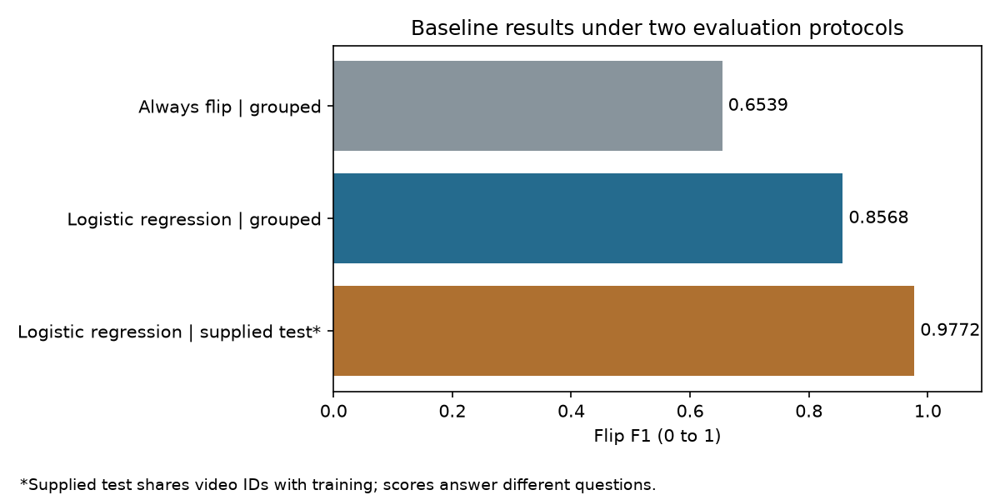

# MonReader: page-flip classification

A reproducible baseline for classifying a document image as **flipping** or **not flipping**, developed in the context of the [Apziva](https://www.apziva.com/) AI Residency.

The main result is **0.8568 F1 on frames from held-out video IDs**, compared with **0.6539** for an always-flip reference. The supplied test split yields **0.9772 F1**, but all 65 filename video IDs also appear in training. This project reports both scores with their evaluation conditions.

[Notebook](01_monreader_baseline.ipynb) | [Results and evidence](reports/results.md) | [Project write-up](docs/article.md)

## Problem and scope

MonReader's broader document-scanning workflow needs to recognize page movement. This experiment addresses the single-image classification task in the supplied [project brief](https://go.apziva.com/project/detail/21/) (sign-in may be required).

The completed work includes a data audit, a CPU-compatible logistic-regression baseline, validation grouped by video ID, error inspection, and saved inference and evaluation artifacts. Sequence detection, OCR, document cropping, and mobile deployment are outside the current implementation.

## Dataset

The provided JPEG files use the naming pattern `VideoID_FrameNumber.jpg`. Labels come from their containing folders.

| Supplied split | Flip | Not flip | Total |
| --- | ---: | ---: | ---: |
| Training | 1,162 | 1,230 | 2,392 |
| Testing | 290 | 307 | 597 |
| Total | 1,452 | 1,537 | 2,989 |

All images decoded successfully and have dimensions of 1080 by 1920 pixels in RGB mode. SHA-256 checks found no repeated file hashes. This does not rule out visually similar or re-encoded frames. The [data manifest](reports/dataset_manifest.csv) records metadata and file hashes without embedding the source images.

There are 65 filename video IDs, and all occur in both supplied folders. Grouping assumes those IDs identify videos consistently, following the brief; independent recording-session provenance is not available.

## Project workflow

1. **Audit the input.** Parse labels and filenames, decode every image, record dimensions, and check exact duplicates and video overlap.
2. **Define validation.** Apply five-fold `StratifiedGroupKFold` within the supplied training folder. Each video ID appears in one validation fold; assertions check separation from the fitting fold.
3. **Prepare image features.** Convert to grayscale, resize to 36 by 64 pixels, divide pixel values by 255, and flatten into 2,304 features. Video IDs and frame numbers are excluded from model inputs.
4. **Fit a baseline.** Fit `StandardScaler` and logistic regression together inside each fold. Settings are fixed: `C=0.01`, `solver="liblinear"`, `max_iter=2000`, seed 42, threshold 0.5. Compare with an always-flip reference on the same folds.
5. **Inspect errors.** Combine out-of-fold predictions, calculate binary flip F1, precision and recall, and inspect a confusion matrix and sampled validation mistakes.
6. **Report the supplied benchmark.** Refit the same predefined model on all training images and evaluate the supplied testing folder separately.
7. **Preserve evidence.** Export predictions, fold membership, data hashes, settings, environment versions, plots, and a fitted model bundle.

## Results

F1 treats `flip` as the positive class. Grouped results pool the out-of-fold predictions for all 2,392 training frames; they are not an equal-weight average over videos.

| Model and evaluation | Flip F1 | Precision | Recall |
| --- | ---: | ---: | ---: |
| Always flip, grouped validation | 0.6539 | 0.4858 | 1.0000 |
| Logistic regression, grouped validation | **0.8568** | 0.8276 | 0.8881 |
| Logistic regression, supplied test | 0.9772 | 0.9929 | 0.9621 |



The learned baseline improves pooled grouped F1 by **0.2029** over the reference on the same folds. Across the five folds, F1 ranges from **0.8040 to 0.9412**, with mean **0.8586** and sample standard deviation **0.0517**. This standard deviation is descriptive, not a confidence interval.

Grouped validation produces 1,032 true positives, 1,015 true negatives, 215 false positives, and 130 false negatives. The notebook shows a sample of the 345 mistakes for further investigation.

**Interpretation:** the supplied-test F1 exceeds pooled grouped F1 by 0.1204. Video overlap makes the supplied split a different benchmark from held-out-video validation. The evaluated frames and fitting-set sizes also differ, so this gap is not an isolated causal estimate of leakage. Neither score establishes performance on new devices, books, recording sessions, or real users.

Numbers above come from [run metadata](reports/metrics.json), [fold scores](reports/fold_metrics.csv), and [exported predictions](reports/README.md). Re-running the notebook reproduces the fixed experiment; it does not create another independent test.

## Reproduce locally

The recorded run used Python 3.14.6 and the package versions in [requirements.txt](requirements.txt). Dependencies were already available in that environment; a clean installation on another machine has not been verified.

Obtain the dataset through the Apziva project and place it in this layout:

```text
images/
  training/
    flip/
    notflip/
  testing/
    flip/
    notflip/
```

From the project root, create an environment and install dependencies. On Windows PowerShell:

```powershell
python -m venv .venv
.\.venv\Scripts\python.exe -m pip install -r requirements.txt
```

In VS Code, open [01_monreader_baseline.ipynb](01_monreader_baseline.ipynb), select the `.venv` Python interpreter as the notebook kernel, and choose **Run All**. The Python and Jupyter extensions are needed for notebook execution. Alternatively:

```powershell
.\.venv\Scripts\python.exe scripts/run_notebook.py
```

Run from the folder containing `images/`. Processing all images can take several minutes on a CPU; no latency benchmark was conducted.

The inference cell defines `predict_image(path)` and saves `outputs/baseline_model.joblib` with the fitted model, preprocessing settings, threshold, labels, and versions. Its probability output has not been assessed for calibration.

## Repository guide

| Artifact | Purpose |
| --- | --- |
| [Notebook](01_monreader_baseline.ipynb) | Executable experiment, rationale, saved results, and image inspection |
| [reports/](reports/README.md) | Recalculable metrics, predictions, fold assignments, metadata, and aggregate plots |
| [Runner](scripts/run_notebook.py) | Executes notebook cells in a local kernel and saves their outputs |
| [Requirements](requirements.txt) | Package versions used for the recorded run |
| [Article draft](docs/article.md) | Step-by-step explanation of the experiment |
| [Resume drafts](docs/resume_bullets.md) | Project and experience bullets linked to the evidence |
| `outputs/` | Local model bundle and image previews, excluded from Git |
| `images/` | Local source data, excluded from Git |

## Limitations and next experiments

- Filename IDs may not separate books, devices, or recording sessions. A stronger external evaluation requires known provenance and independent data.
- Small grayscale pixel vectors discard detail and depend on image alignment. A convolutional or pretrained image model can be compared using the same grouped development protocol.
- A single frame can be ambiguous about motion. The optional sequence task needs explicitly defined windows, labels, and sequence-level evaluation.
- Hyperparameters and the threshold were not tuned. Any later selection should use training-only grouped validation, with fresh independent data reserved for final evaluation.
- Scanning quality, inference latency, calibration, and user benefit have not been measured.

## Contribution and conclusion

The work establishes a baseline that exceeds a fixed reference under an explicit video-grouped protocol. Its practical contribution is an inspectable path from raw frames to predictions, with enough saved evidence to check the reported numbers and evaluate later changes.

For a technical reviewer, the notebook demonstrates data validation, grouped cross-validation, preprocessing within each training fold, baseline comparison, error analysis, and reproducible reporting. The conclusions are limited to the experiment that was run.

Project context and dataset: [Apziva](https://www.apziva.com/). Method references are included in the notebook. The repository uses the identifier required by the brief: [Abdulrahmanos/2ootcRDyofSiIM8i](https://github.com/Abdulrahmanos/2ootcRDyofSiIM8i). Apziva submission is a separate step.
