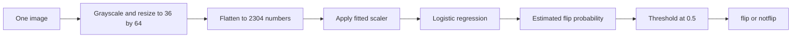

# Code walkthrough: from an image to a prediction

Read this alongside [the notebook](../01_monreader_baseline.ipynb). The section numbers match the notebook. Code excerpts depend on variables defined in earlier notebook cells.

## How complex is it?

The model is a small, conventional machine-learning baseline: **logistic regression on resized grayscale pixels**. Despite its name, logistic regression performs classification here. It is not a neural network and does not use pretrained weights, OCR, or a sequence of frames.

The full notebook is longer because it also checks the dataset, evaluates the model carefully, draws plots, and saves evidence. Those support tasks are useful, but you do not need to understand every reporting line before understanding how predictions work.

Start with sections **4, 5, and 8** below. Then read section **3**, which explains the most important evaluation decision.



**Training** learns scaler statistics and model weights from labeled images. **Prediction** reuses those fitted values for another image; it does not learn from that image's answer.

## The main variables

| Variable | Meaning | Shape or contents |
| --- | --- | --- |
| `df` | Inventory of every supplied image | 2,989 rows of metadata |
| `train`, `test` | Metadata for the supplied folders | 2,392 and 597 rows |
| `X_train` | Image features used as model inputs | `(2392, 2304)` |
| `y_train` | Correct training answers | `(2392,)`, values 0 or 1 |
| `folds` | Five pairs of fitting and validation row positions | `(fit_idx, val_idx)` pairs |
| `baseline` | Unfitted scaler and classifier template | A scikit-learn pipeline |
| `oof_predictions` | One held-out prediction per training frame, for each model | Two arrays, each length 2,392 |
| `final_model` | Baseline fitted on all supplied training images | Used for the supplied test and inference |

`X` conventionally means inputs; `y` means targets. Here `0 = notflip` and `1 = flip`. Video IDs identify validation groups, not input features.

## Setup: imports and paths

The imports provide tools instead of requiring us to implement image decoding, plotting, or model optimization ourselves:

| Library | Role here |
| --- | --- |
| `pathlib`, `re` | Work with paths and parse filenames |
| Pillow (`PIL`) | Open, orient, resize, and convert images |
| NumPy | Hold image features as numerical arrays |
| pandas | Organize metadata, predictions, and results in tables |
| scikit-learn | Split groups, fit models, and calculate metrics |
| Matplotlib | Draw image grids and evaluation plots |
| `hashlib`, `json`, `joblib` | Record file fingerprints, write reports, and save the model |

`ROOT = Path.cwd()` means the current working folder. Run the notebook from the folder containing `images/`. `OUTPUT.mkdir(exist_ok=True)` creates an output folder if needed. An `assert` checks an assumption and stops execution with an error when it is false.

`SEED = 42` fixes randomness in splitting, sampling, and the selected solver. The number 42 is arbitrary; using the same seed helps reproduce the same experiment in the recorded environment.

## 1. Build a metadata table

The nested loops visit each split (`training` or `testing`), each label folder, and each JPEG file. For every image, the code appends a dictionary to `records`. `pd.DataFrame(records)` turns those dictionaries into table rows.

```python
match = re.fullmatch(r"(\d+)_(\d+)", path.stem)
```

`path.stem` is the filename without `.jpg`. In `0001_000000010.jpg`, the first digit group is video ID `0001`; the second is frame number `000000010`. `match.group(1)` retains the ID as a string so leading zeros remain. `int(match.group(2))` converts the frame number to 10.

`with Image.open(path) as img:` opens the image and closes the file when the block finishes. `img.load()` forces decoding, which can catch a damaged image even when its header is readable.

```python
hashlib.sha256(path.read_bytes()).hexdigest()
```

This creates a fingerprint from the file's bytes. Repeated fingerprints flag exact duplicate files. Different fingerprints do not guarantee visually different images.

`pd.crosstab(df["split"], df["label"])` counts images by split and class. The final grouped assertion checks that identical file hashes do not carry conflicting target labels.

## 2. Separate metadata and show examples

```python
train = df.loc[df["split"].eq("training")].reset_index(drop=True)
```

`eq("training")` creates a True/False mask. `.loc[...]` selects the matching rows. `reset_index(drop=True)` renumbers them from zero, which makes later array positions line up with table rows.

`.sample(4, random_state=SEED)` selects four examples per class. `.itertuples()` lets the plotting loop access values such as `sample.path`. `zip(axes[row], samples.itertuples())` pairs each selected image with a subplot.

The thumbnail operations affect the preview only. Section 4 separately defines the features actually given to the model.

## 3. Keep videos separate during validation

```python
shared_videos = sorted(set(train["video_id"]) & set(test["video_id"]))
```

A `set` keeps distinct values; `&` computes their intersection. This finds 65 video IDs shared by the supplied folders.

If nearby frames from the same video occur in both fitting and validation, they may share substantial visual context. We therefore make a second evaluation within the training folder, using video ID as a group:

```python
cv = StratifiedGroupKFold(n_splits=5, shuffle=True, random_state=SEED)
folds = list(cv.split(train, train["target"], groups=train["video_id"]))
```

Each iteration returns two arrays of row positions:

- `fit_idx`: the rows used to fit this fold's model.
- `val_idx`: the rows used to evaluate it.

The splitter keeps each group together and attempts to balance label proportions. For example, the first fold fits on 1,899 images and evaluates 493 images belonging to 12 held-out IDs. Across all five folds, every training row is evaluated once. Fold sizes differ because videos contain different numbers of frames. [Splitter reference](https://scikit-learn.org/stable/modules/generated/sklearn.model_selection.StratifiedGroupKFold.html).

The assertions check disjoint video IDs, disjoint exact hashes, and the presence of both classes in each fitting/validation pair. This verifies separation by filename ID; it cannot establish whether different IDs share a recording session.

## 4. Turn an image into 2,304 numbers

This is the feature-extraction function:

```python
IMAGE_SIZE = (36, 64)

def image_features(path):
    with Image.open(path) as img:
        img = ImageOps.exif_transpose(img).convert("L")
        img = img.resize(IMAGE_SIZE, Image.Resampling.BILINEAR)
        return np.asarray(img, dtype=np.float32).reshape(-1) / 255.0
```

Read it one operation at a time:

1. `Image.open` reads the image.
2. `exif_transpose` applies any orientation indicated by its metadata.
3. `convert("L")` makes a single grayscale channel.
4. `resize` produces a 36-wide, 64-high image. Pillow takes `(width, height)`; the resulting NumPy image array has shape `(64, 36)`.
5. `np.asarray(..., dtype=np.float32)` converts pixel values into floating-point numbers.
6. `reshape(-1)` flattens the grid into a vector. `-1` asks NumPy to calculate its length: `36 * 64 = 2304`.
7. `/ 255.0` maps brightness values from 0-255 to 0-1.

Flattening keeps a consistent pixel order. It removes the explicit grid shape but preserves a correspondence between each feature and a resized pixel position. The classifier is therefore sensitive to where objects appear.

```python
X_train = np.stack([image_features(path) for path in train["path"]])
y_train = train["target"].to_numpy()
```

The list comprehension applies the function to every training image. `np.stack` places the vectors into one matrix: **one row per image, one column per pixel position**. `y_train` holds the answers in matching row order.

## 5. Fit the model and collect held-out predictions

### What the pipeline learns

```python
baseline = make_pipeline(
    StandardScaler(),
    LogisticRegression(C=0.01, solver="liblinear", max_iter=2000, random_state=SEED),
)
```

`make_pipeline` joins two fitted steps. `StandardScaler` learns a mean and standard deviation for each pixel-position feature from the fitting rows. It transforms each value using `(value - training_mean) / training_std`; a feature with zero variance uses scale 1. Validation and test images use the stored fitting statistics. Dividing by 255 earlier fixes the numeric range; this later scaling standardizes each feature across fitting images. [Scaler reference](https://scikit-learn.org/stable/modules/generated/sklearn.preprocessing.StandardScaler.html).

Logistic regression learns 2,304 feature weights and an intercept for this binary problem. Conceptually, it calculates:

```text
score = intercept + weight_1 * scaled_pixel_1 + ... + weight_2304 * scaled_pixel_2304
estimated_flip_probability = 1 / (1 + exp(-score))
```

Fitting adjusts the weights to reduce a classification loss while penalizing large weights. The library performs this optimization. There is no manually coded rule that identifies a hand or page edge.

| Setting | Meaning in this model |
| --- | --- |
| `C=0.01` | Inverse regularization strength; a smaller value applies a stronger penalty |
| `solver="liblinear"` | The algorithm used to optimize the weights |
| `max_iter=2000` | Upper limit on optimization iterations, not a request for 2,000 epochs |
| `random_state=SEED` | Controls solver randomness where applicable |

These are fixed baseline choices, not settings established as optimal by a search. [Logistic regression reference](https://scikit-learn.org/stable/modules/generated/sklearn.linear_model.LogisticRegression.html).

### Why include a model that always predicts flip?

`DummyClassifier(strategy="constant", constant=1)` predicts the positive class for every image. Its grouped F1 is 0.6539 despite using no image information. Comparing against it shows whether the learned baseline improves on a simple rule under the same metric and folds.

### The core training loop

```python
predictions = np.full(len(train), -1, dtype=int)
for fold, (fit_idx, val_idx) in enumerate(folds, start=1):
    model = clone(template)
    with threadpool_limits(limits=2):
        model.fit(X_train[fit_idx], y_train[fit_idx])
        predictions[val_idx] = model.predict(X_train[val_idx])
```

- `np.full(..., -1)` creates an array of unfinished predictions. Because the real classes are 0 and 1, any remaining -1 identifies a missing result.
- `enumerate(..., start=1)` gives each fold a readable number.
- `clone(template)` creates a fresh, unfitted copy with the same settings. Each fold learns its own scaler and model.
- `threadpool_limits(limits=2)` limits supported numerical-library threads; it does not change the evaluation split or model design.
- `.fit(X, y)` learns from inputs and known answers. The pipeline fits the scaler on the fitting subset and passes transformed inputs to the classifier.
- `.predict(X)` uses the fitted pipeline to return class labels for the held-out rows.
- `predictions[val_idx] = ...` puts answers back in their original row positions.

The outer loop repeats this process for both model templates. These are **out-of-fold (OOF) predictions**: each training frame receives a prediction from a model that excluded its video ID from fitting.

`f1_score` measures each fold and the pooled prediction array. `groupby("model")["f1"].agg(["mean", "std"])` summarizes fold scores, while `.join(...)` attaches them to the pooled metrics table. `pivot` only rearranges the display; it does not retrain anything.

## 6. Read the confusion matrix and mistakes

Rows are actual labels and columns are predicted labels, both ordered `[notflip, flip]`:

| | Predicted notflip | Predicted flip |
| --- | ---: | ---: |
| Actual notflip | 1,015 true negatives | 215 false positives |
| Actual flip | 130 false negatives | 1,032 true positives |

For the flip class:

```text
precision = 1032 / (1032 + 215) = 0.8276
recall    = 1032 / (1032 + 130) = 0.8881
F1        = 2 * 1032 / (2 * 1032 + 215 + 130) = 0.8568
```

`zero_division=0` makes undefined metric cases return zero rather than producing a warning. It does not change these results because their denominators are nonzero.

The expression `oof_predictions["logistic_pixels"] != y_train` returns a mask of incorrect predictions. Applying it to `train` selects 345 errors; sampling six makes a readable image grid. Those examples suggest questions to investigate but do not prove why the model failed.

## 7. Refit and evaluate the supplied test folder

```python
final_model = clone(baseline)
final_model.fit(X_train, y_train)
test_probability = final_model.predict_proba(X_test)[:, 1]
test_prediction = (test_probability >= 0.5).astype(int)
```

Cross-validation produced five temporary learned logistic models. This creates one new model fitted on all supplied training images for reuse and the supplied benchmark.

`predict_proba` returns one column per class. The fitted class order here is `[0, 1]`, so `[:, 1]` means all rows, column 1: the estimated probability of `flip`. Comparing with 0.5 creates True/False values; `.astype(int)` converts them into 1/0 predictions.

The supplied-test F1 is 0.9772, but its video IDs overlap training. The grouped and supplied-test scores describe different conditions. Fitting-set sizes and evaluated frames also differ, so the gap alone does not isolate the effect of video overlap.

## 8. Save the model and predict one image

`joblib.dump(bundle, ...)` serializes the fitted pipeline and its configuration. This lets a later process reuse the learned values. The current notebook's helper uses the `final_model` already in memory:

```python
def predict_image(path):
    features = image_features(Path(path)).reshape(1, -1)
    probability = float(final_model.predict_proba(features)[0, 1])
    return {"label": CLASS_NAMES[int(probability >= 0.5)], "flip_probability": probability}
```

`reshape(1, -1)` makes a matrix with one image row, because scikit-learn expects two-dimensional inputs even for one image. `[0, 1]` selects that row's flip probability. `CLASS_NAMES[0]` is `notflip`; `CLASS_NAMES[1]` is `flip`.

This estimate has not been checked for calibration: a reported 0.9 does not by itself establish a 90% real-world success rate. The example image comes from the supplied test set and demonstrates usage rather than an external evaluation.

## 9. Understand the reporting code

The final code cell adds no new training. It packages results so someone can inspect them later:

- Copies the inventory into a manifest and replaces absolute paths with project-relative paths.
- Adds each training frame's validation fold and both models' predictions to an OOF table.
- Writes CSV tables, aggregate plots, and a generated results summary.
- Records model settings, dependency versions, and hashes in `reports/metrics.json`.

`.to_csv(index=False)` omits pandas' extra row index. `.to_dict(orient="index")` prepares a table for JSON. An f-string such as `f"{pooled:.4f}"` inserts a value rounded to four decimal places for display. `_ = path.write_text(...)` ignores the returned character count so it does not become a distracting notebook output.

The code hash identifies the code-cell text, not the Markdown explanation or rendered outputs. File fingerprints are useful for matching artifacts to a run; they are not proof that an experiment was conducted correctly. The executable split logic and saved predictions provide complementary evidence.

## What does `scripts/run_notebook.py` do?

This is an optional automation helper, separate from the classifier. You can use VS Code's **Run All** without understanding its internals.

1. It reads the notebook JSON and clears outputs in its in-memory copy.
2. `KernelManager` starts a Python notebook kernel in the project folder.
3. It submits each code cell in order. Markdown cells are skipped.
4. It collects printed text, tables, figures, execution counts, and errors from kernel messages.
5. It saves the notebook after each cell, stops if a cell errors or exceeds 15 minutes, and shuts the kernel down in a `finally` block.

The message-ID check associates outputs with the right execution. `queue.Empty` means no message has arrived yet, not that training failed. This machinery preserves outputs; the machine-learning implementation remains in the notebook.

## A practical reading exercise

Before experimenting with new settings, check that you can answer these from the code:

1. Why does one image become 2,304 features? `36 * 64`, with one grayscale channel.
2. Which function learns the weights? `model.fit(...)`, through the pipeline's classifier.
3. Which values never become model features? The filename, video ID, frame number, and target label.
4. Why fit the scaler inside each fold? So it learns statistics only from that fold's fitting rows.
5. What does OOF mean? Each prediction was produced while the corresponding video ID was excluded from fitting.
6. Why keep the two F1 scores separate? Their evaluation protocols answer different questions.

After that, changing the feature representation or comparing another classifier becomes easier to reason about. Keep the grouped development protocol fixed for a fair comparison, and reserve independent data for future final evaluation.
